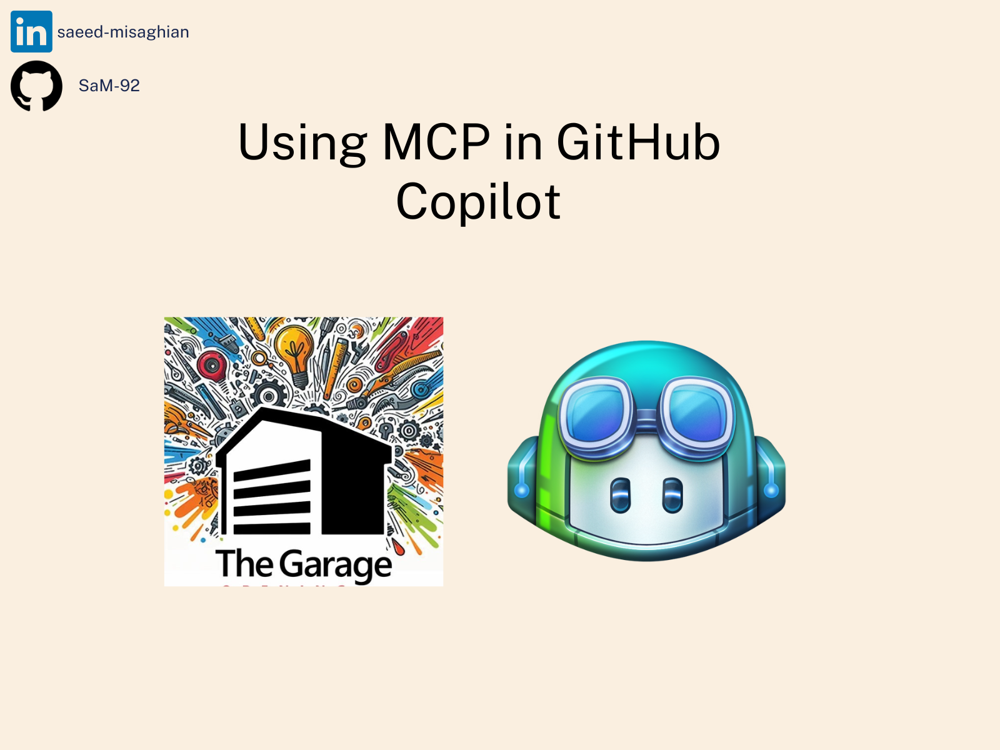

# MCP Demo for GitHub Copilot



# What is MCP?

The Model Context Protocol (MCP), developed by Anthropic, is an open standard designed to enable large language models (LLMs) to interact seamlessly with external tools and data sources. By standardizing these interactions, MCP allows AI systems to perform tasks like reading files, executing functions, and handling contextual prompts across various platforms. In the context of GitHub Copilot, MCP enhances the agent mode in Visual Studio Code, enabling the AI to access tools such as GitHub repositories, databases, and web services directly. This integration allows developers to execute complex tasks—like updating a GitHub profile based on recent pull requests—through natural language prompts, streamlining workflows and boosting productivity.


*Image Source: What is Model Context Protocol (MCP)? by Norah Sakal*

## Available Tools

This repository provides the following MCP tools:

**From `server.py` (My App):**

- `add_list_of_numbers`: Adds a list of numbers.
- `add_two_numbers`: Adds two numbers.
- `get_weather`: Gets weather information for a city.

**From `server2.py` (Code Analysis Tools):**

- `check_variable_naming`: Checks variable names to ensure they follow snake_case format.
- `check_security_leakages`: Checks code for potential security leakages like API keys, tokens, etc.

````
`test_code.py` is a script to test these MCP tools.
````

## 🛠️ Prerequisites

Ensure you have Python 3.12 installed.

- Install `uv` if not already installed:
```bash
pip install uv
```
- Get your Apify API key from [Apify MCP Server page](https://apify.com/apify/actors-mcp-server)


